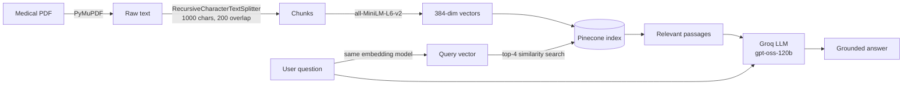

<div align="center">

# 🩺 Medical RAG Assistant

**Ask a medical question. Get an answer grounded in your own reference book, not the model's guesswork.**


<!-- Save a screenshot of the chat as screenshot.png in the repo root, then remove the two comment markers below -->
<!--  -->

</div>

---

## Why this exists

General-purpose LLMs can hallucinate or miss domain detail when asked medical questions. This project uses **Retrieval-Augmented Generation (RAG)**: it first finds the exact passages in a 600+ page medical book that relate to your question, then asks the LLM to answer *only* from those passages. If the book doesn't cover it, the assistant says so.

## Features

- **Grounded answers.** Responses are built from retrieved book passages, with instructions to refuse when the context doesn't contain the answer.
- **Fast.** Semantic search in Pinecone plus Groq inference keeps responses quick.
- **Clean reading UI.** Document-style answers, suggested starter questions, a thinking indicator, copy button, and automatic light/dark mode.
- **Keys stay private.** Secrets load from a `.env` file that is never committed.

## How it works



**Two phases:**

1. **Ingestion (run once):** extract text, split it into overlapping chunks, embed each chunk, and store the vectors in Pinecone.
2. **Query (every question):** embed the question, retrieve the 4 closest chunks, and have the LLM answer from that context only.

## Project structure

```
medical-rag-assistant/
├── pdf_reader.py        # PDF -> medical_text.txt (PyMuPDF)
├── ingest.py            # chunking sanity check
├── upload.py            # embed chunks and upload to Pinecone
├── app.py               # Flask server: retrieval + generation
├── templates/
│   └── index.html       # chat interface
├── requirements.txt
└── .env.example         # copy to .env and add your keys
```

## Quick start

**1. Clone and install**

```bash
git clone https://github.com/rakshabhardwaj/medical-rag-assistant.git
cd medical-rag-assistant
python -m venv venv
venv\Scripts\activate        # Windows
pip install -r requirements.txt
```

**2. Add your keys.** Copy `.env.example` to `.env` and fill it in (no quotes):

```
PINECONE_API_KEY=your-pinecone-key
GROQ_API_KEY=your-groq-key
```

**3. Add your book.** Put a PDF at `uploads/Medical_book.pdf`.

**4. Ingest (one time)**

```bash
python pdf_reader.py    # extract text
python upload.py        # embed and upload to Pinecone
```

**5. Run**

```bash
python app.py
```

Open http://127.0.0.1:5000 and start asking.

## Design decisions

| Choice | Why |
|---|---|
| Text extraction instead of OCR | The first version rendered every page to an image and ran Tesseract, which took hours for 637 pages. Selectable-text PDFs extract in minutes with `get_text()`. |
| 1000-char chunks, 200 overlap | Big enough to keep a full idea together, with overlap so answers aren't cut at chunk boundaries. |
| `all-MiniLM-L6-v2` | Small, fast, runs on CPU, and produces 384-dim vectors that fit a free Pinecone tier. |
| Strict "answer from context only" prompt | Reduces hallucination and makes the assistant admit when the book has no answer. |
| Secrets in `.env` | Keys never touch the repo; `.env.example` documents what is needed. |

## Limitations and ideas for next steps

- Scanned PDFs (no selectable text) need an OCR step in `pdf_reader.py`.
- Answers don't yet show their source passages or page numbers. Storing page numbers in chunk metadata would enable citations.
- No chat memory: each question is answered independently.
- The Pinecone index must use dimension 384 and cosine similarity to match the embedding model.

## Disclaimer

For study and reference only. Not a substitute for professional medical advice.
