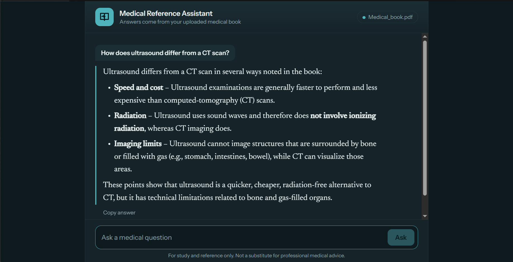
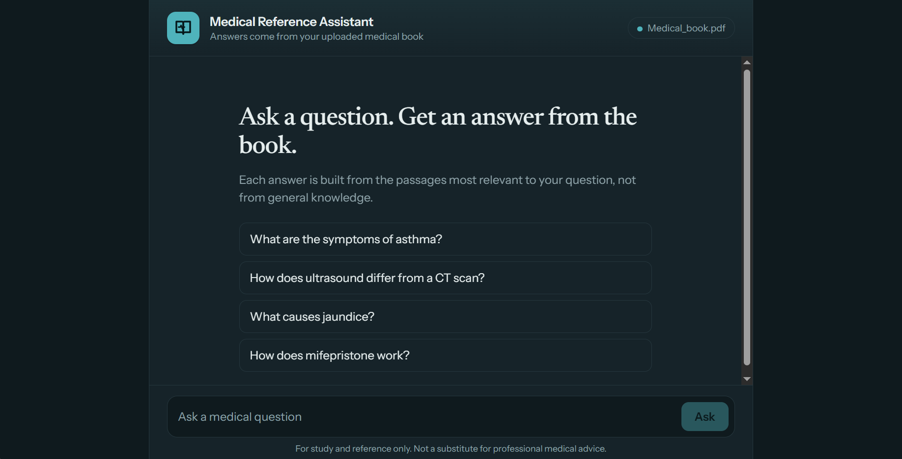
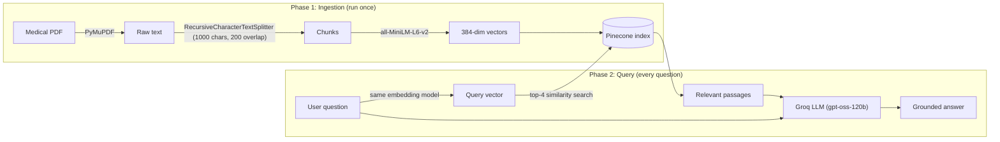

<div align="center">

# 🩺 Medical RAG Assistant

### Ask a medical question. Get an answer grounded in your own reference book, not the model's guesswork.


<br>



</div>

---

## 📖 Table of contents

- [Why this exists](#-why-this-exists)
- [Demo](#-demo)
- [Features](#-features)
- [How it works](#-how-it-works)
- [Tech stack](#-tech-stack)
- [Project structure](#-project-structure)
- [Quick start](#-quick-start)
- [Configuration](#-configuration)
- [Design decisions](#-design-decisions)
- [Troubleshooting](#-troubleshooting)
- [Limitations and roadmap](#-limitations-and-roadmap)
- [Disclaimer](#-disclaimer)

---

## 💡 Why this exists

General-purpose LLMs can hallucinate or miss domain detail when asked medical questions, and in medicine a confident wrong answer is the worst kind of answer.

This project uses **Retrieval-Augmented Generation (RAG)** to fix that. It first finds the exact passages in a 600+ page medical reference book that relate to your question, then asks the LLM to answer **only from those passages**. If the book doesn't cover the question, the assistant says so instead of making something up.

---

## 🎬 Demo

<table>
  <tr>
    <td align="center" width="50%">
      <b>Home screen</b><br><br>
      
    </td>
    <td align="center" width="50%">
      <b>Grounded answer</b><br><br>
      
    </td>
  </tr>
</table>

**Try questions like:**

- *What are the symptoms of asthma?*
- *How does ultrasound differ from a CT scan?*
- *What causes jaundice?*
- *How does mifepristone work?*

Ask something the book doesn't cover and it will tell you, rather than guess.

---

## ✨ Features

| | |
|---|---|
| 🎯 **Grounded answers** | Responses are built from retrieved book passages, with instructions to refuse when the context doesn't contain the answer. |
| ⚡ **Fast** | Semantic search in Pinecone plus Groq inference keeps responses quick. |
| 🔎 **Semantic retrieval** | Finds relevant passages by meaning, not just keyword matching. |
| 🖥️ **Clean reading UI** | Document-style answers, suggested starter questions, a thinking indicator, a copy button, and automatic light/dark mode. |
| 🔐 **Keys stay private** | Secrets load from a `.env` file that is never committed. |
| 🧩 **Simple to extend** | Small, readable codebase: one script per stage of the pipeline. |

---

## ⚙️ How it works



**Phase 1: Ingestion (one time)**
Extract the text, split it into overlapping chunks, embed each chunk, and store the vectors in Pinecone.

**Phase 2: Query (every question)**
Embed the question with the same model, retrieve the 4 closest chunks, and have the LLM answer from that context only.

---

## 🧰 Tech stack

| Layer | Technology |
|---|---|
| Language | Python |
| Backend | Flask |
| PDF extraction | PyMuPDF |
| Chunking | LangChain `RecursiveCharacterTextSplitter` |
| Embeddings | `all-MiniLM-L6-v2` via sentence-transformers (384 dimensions) |
| Vector database | Pinecone (cosine similarity) |
| LLM inference | Groq, `openai/gpt-oss-120b` |
| Frontend | HTML, CSS, JavaScript (single-page chat UI) |

---

## 📁 Project structure

```
medical-rag-assistant/
├── pdf_reader.py          # PDF -> medical_text.txt (PyMuPDF)
├── ingest.py              # chunking sanity check
├── upload.py              # embed chunks and upload to Pinecone
├── app.py                 # Flask server: retrieval + generation
├── templates/
│   └── index.html         # chat interface
├── static/                # front-end assets
├── screenshots/           # images used in this README
├── uploads/               # put your PDF here (not committed)
├── requirements.txt
└── .env.example           # copy to .env and add your keys
```

---

## 🚀 Quick start

### 1. Clone and install

```bash
git clone https://github.com/rakshabhardwaj/medical-rag-assistant.git
cd medical-rag-assistant
python -m venv venv
```

Activate the virtual environment:

```bash
# Windows
venv\Scripts\activate

# macOS / Linux
source venv/bin/activate
```

Install dependencies:

```bash
pip install -r requirements.txt
```

### 2. Add your API keys

Copy `.env.example` to `.env`:

```bash
# Windows
copy .env.example .env

# macOS / Linux
cp .env.example .env
```

Then open `.env` and fill in your keys (no quotes):

```
PINECONE_API_KEY=your-pinecone-key
GROQ_API_KEY=your-groq-key
```

### 3. Create the Pinecone index

In your Pinecone dashboard, create an index with:

- **Dimension:** `384`
- **Metric:** `cosine`

### 4. Add your book

Put a text-based PDF at:

```
uploads/Medical_book.pdf
```

> The book itself is not included in this repo. Use any medical reference you have the right to use.

### 5. Ingest (one time only)

```bash
python pdf_reader.py    # extract text from the PDF
python upload.py        # embed chunks and upload to Pinecone
```

### 6. Run the app

```bash
python app.py
```

Open **http://127.0.0.1:5000** and start asking.

---

## 🔧 Configuration

| Setting | Value used | Notes |
|---|---|---|
| Chunk size | 1000 characters | Large enough to keep a full idea together |
| Chunk overlap | 200 characters | Prevents answers being cut at chunk boundaries |
| Embedding model | `all-MiniLM-L6-v2` | 384-dim, runs on CPU |
| Retrieval | Top 4 chunks | Increase for broader context, decrease for tighter answers |
| LLM | `openai/gpt-oss-120b` on Groq | Swap for any Groq-hosted model |
| Index metric | Cosine | Must match the embedding model |

If you change the embedding model, the Pinecone index dimension must change with it, and you must re-run `upload.py`.

---

## 🧠 Design decisions

| Choice | Why |
|---|---|
| **Text extraction instead of OCR** | The first version rendered every page to an image and ran Tesseract, which took hours for 637 pages. Selectable-text PDFs extract in minutes with PyMuPDF's `get_text()`. |
| **1000-char chunks, 200 overlap** | Big enough to keep a full idea together, with overlap so answers aren't cut at chunk boundaries. |
| **`all-MiniLM-L6-v2` embeddings** | Small, fast, runs on CPU, and produces 384-dim vectors that fit a free Pinecone tier. |
| **Strict "answer from context only" prompt** | Reduces hallucination and makes the assistant admit when the book has no answer. |
| **Pinecone for storage** | Managed vector search means no local index to maintain, and queries stay fast as the book grows. |
| **Secrets in `.env`** | Keys never touch the repo; `.env.example` documents what is needed. |

---

## 🛠️ Troubleshooting

<details>
<summary><b>The assistant says the book doesn't cover my question</b></summary>

That is intended behavior when the retrieved passages don't contain the answer. Try rephrasing the question, using the terminology the book uses, or confirm the topic is actually in your PDF.
</details>

<details>
<summary><b>Pinecone dimension mismatch error</b></summary>

Your index must be created with dimension `384` and the `cosine` metric to match `all-MiniLM-L6-v2`. Delete and recreate the index if it was set up differently.
</details>

<details>
<summary><b><code>medical_text.txt</code> is empty or garbled</b></summary>

Your PDF is probably scanned (images, no selectable text). Plain extraction can't read it, so `pdf_reader.py` would need an OCR step.
</details>

<details>
<summary><b>Authentication or "missing API key" errors</b></summary>

Check that `.env` exists in the project root, has both keys, and that the values have no quotes or extra spaces. Restart the app after editing it.
</details>

---

## 🗺️ Limitations and roadmap

**Current limitations**

- Scanned PDFs (no selectable text) need an OCR step in `pdf_reader.py`.
- Answers don't yet show their source passages or page numbers.
- No chat memory: each question is answered independently.
- Markdown tables in answers are not rendered as tables yet.

**Ideas for next steps**

- [ ] Store page numbers in chunk metadata and show **source citations** with each answer
- [ ] Add **conversation memory** for follow-up questions
- [ ] Add an **OCR fallback** for scanned PDFs
- [ ] **Stream** answers token by token
- [ ] Render markdown tables in the chat UI
- [ ] Support **multiple books** and a document picker
- [ ] Add a **Dockerfile** for one-command setup
- [ ] Add **retrieval evaluation** (a small test set of questions with expected passages)

---

## ⚠️ Disclaimer

This project is for **study and reference only**. It is not a substitute for professional medical advice, diagnosis, or treatment. Always consult a qualified healthcare professional for medical decisions.

---

<div align="center">

Built with Flask, Pinecone, and Groq.

If you found this useful, consider giving the repo a ⭐

</div>
